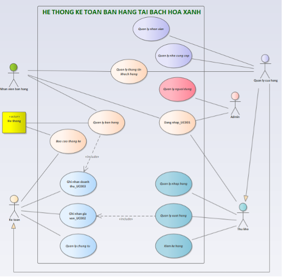
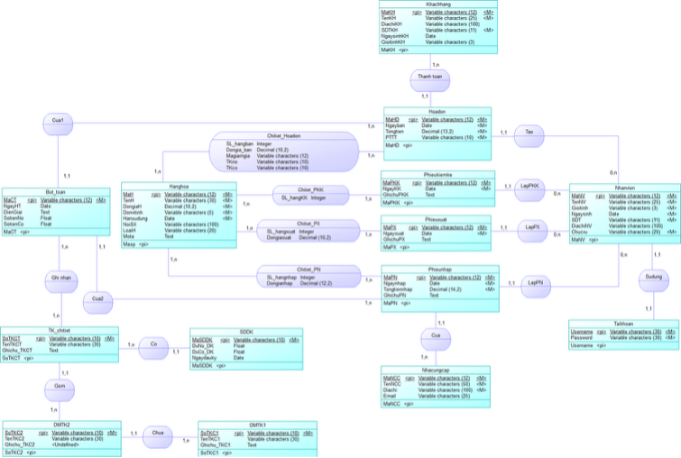
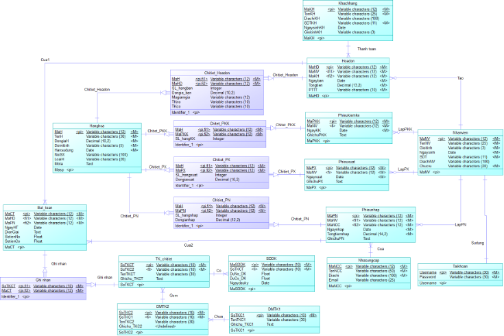
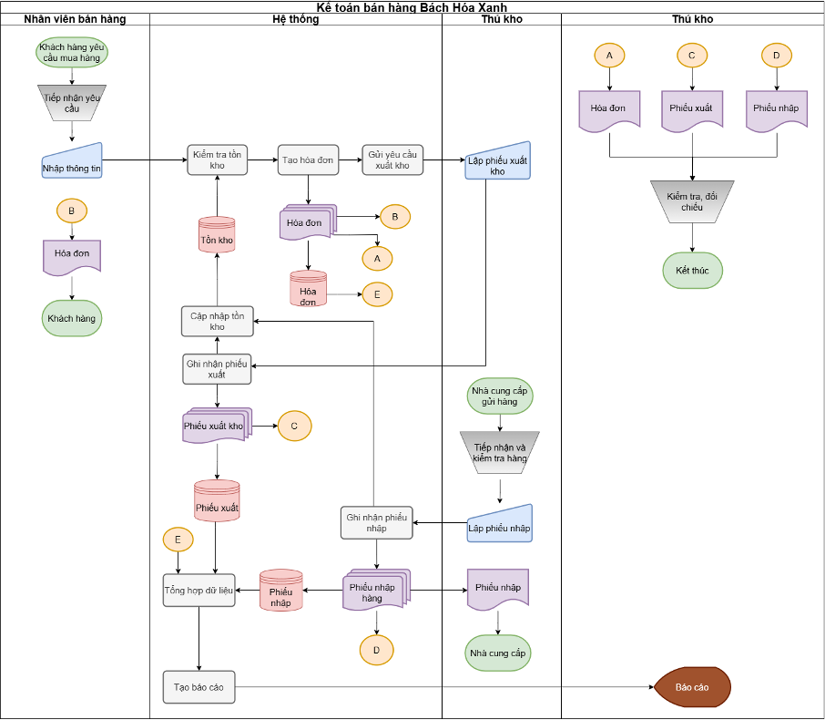
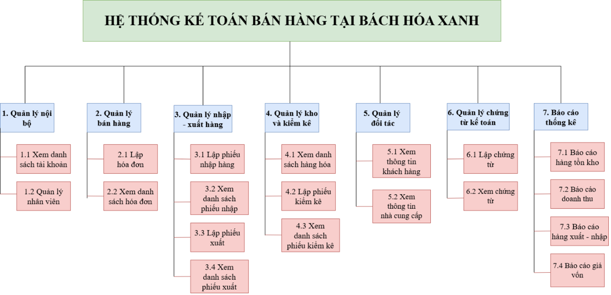
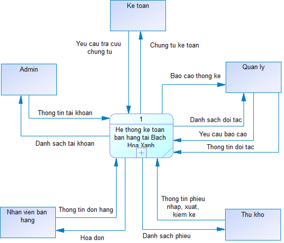
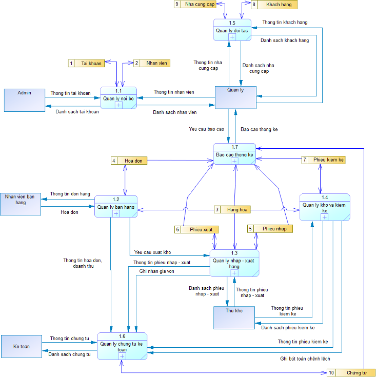
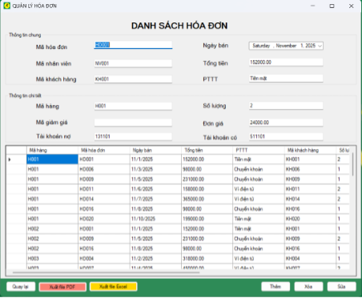
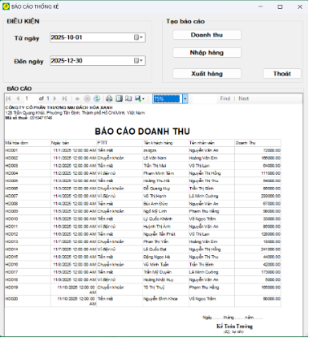

# Project-Accounting-Information-System
## Giới thiệu
Dự án xây dựng Hệ thống thông tin kế toán bán hàng nhằm hỗ trợ quản lý hoạt động bán hàng, kiểm soát tồn kho, xử lý dữ liệu kế toán và lập báo cáo tại Bách Hóa Xanh.
Hệ thống hướng đến việc chuẩn hóa quy trình nghiệp vụ, giảm thao tác thủ công và nâng cao độ chính xác trong quản lý dữ liệu.

## Chức năng chính
- Đăng nhập và phân quyền người dùng
- Quản lý hàng hóa
- Quản lý hóa đơn bán hàng
- Quản lý nhập – xuất – tồn kho
- Quản lý khách hàng và nhà cung cấp
- Quản lý chứng từ kế toán
- Báo cáo doanh thu và thống kê

## Thiết kế hệ thống
### Sơ đồ Use Case

### Thiết kế cơ sở dữ liệu (ERD)

### Mô hình LDM

### Flowchart

### Mô hình phân rã chức năng

### Mô hình DFD Mức 0

### Mô hình DFD Mức 1

## Giao diện minh họa của dự án
### Quản lý hóa đơn

### Báo cáo doanh thu

